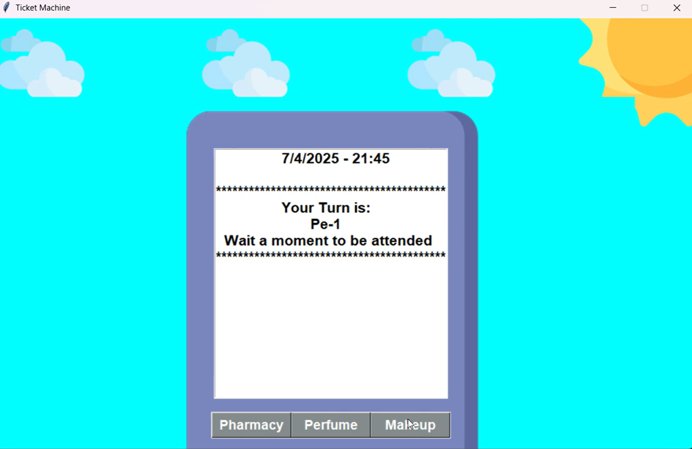

# Ticket Machine Application

This repository contains the source code for a ticket machine application developed in Python using the Tkinter library.

## Description

The ticket machine application initializes and sets up the main window, loads background images, creates the screen and buttons, and runs the main loop.

## 📸 Media

  
</p

Watch the video demonstration of the application, titled "Ticket Machine Functionality," [here](https://youtu.be/OD26yUGbAiE).

## Technologies Used
- **Language**: Python
- **UI Framework**: Tkinter
- **Concepts**: Event-driven programming, modular design
- **Assets**: Image-based UI elements

## Project Structure

- `main.py`: This module initializes the ticket machine application, sets up the main window, loads background images, creates the screen and buttons, and starts the main loop.
- `image_loader.py`: Module responsible for loading background images.
- `screen.py`: Module responsible for creating the application screen to display the program output.
- `buttons.py`: Module responsible for creating the application buttons.
- `turns.py`: Module responsible for handling the turns algorithm for each button.

## Features
- **Interactive UI**: Simple and intuitive interface for ticket selection.
- **Turn Management**: Implements an algorithm to handle turns for multiple buttons.
- **Image-based Design**: Uses background images and styled buttons for a better user experience.
- **Modular Architecture**: Separate components for screen, buttons, image loading, and turn logic.
- **Lightweight**: Runs efficiently on standard Python environments.

---

## 📬 Contact

If you'd like to collaborate or have any questions:

📧 **badillouribeguillermoca@gmail.com**  
🔗 **LinkedIn:** https://www.linkedin.com/in/guillermo-badillo-uribe-382301228/

---

## 📄 License
This repository is licensed under the MIT License.
